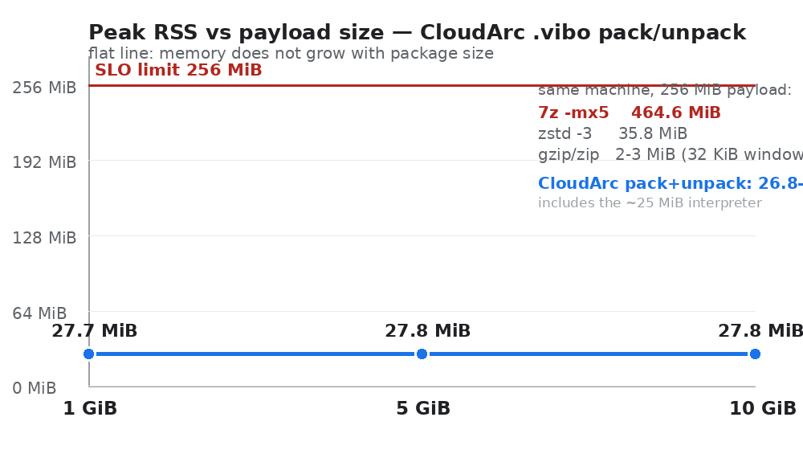

# CloudArc

**Pack a 10 GiB folder into a single `.vibo` archive without the memory growing — 25.9 MiB peak RSS for pack, 31.2 MiB for unpack, flat from 1 GiB to 10 GiB — then read its metadata remotely without ever fetching the payload.**

Apache-2.0 · no cloud credentials needed to try · Python 3.11+



| payload | pack peak RSS | unpack peak RSS |
|---|---|---|
| 1 GiB | 26.0 MiB | 29.7 MiB |
| 5 GiB | 25.8 MiB | 31.0 MiB |
| 10 GiB | **25.9 MiB** | **31.2 MiB** |

Normative limits: peak RSS ≤ 256 MiB and peak-RSS spread across 1/5/10 GiB ≤ 64 MiB
(measured spread 0.2 MiB pack, 1.5 MiB unpack). Environment and raw run artifacts:
[LARGE_PACKAGE_BENCHMARK.md](LARGE_PACKAGE_BENCHMARK.md).

## What it does that `tar` and `zip` do not

1. **Metadata reads never touch the data section.** `info`, `list` and `search` work over HTTP
   range requests; CI rejects any response that claims `data_section_read`.
2. **High-cardinality multi-file packages.** A 5,000-file profile with a versioned manifest and an
   index document per entry, plus content dedup by SHA-256.
3. **Safety defaults.** Everything is a preview unless `--apply`/`--yes`; overwriting creates a
   sibling backup; unpack verifies size and SHA-256 per entry; path escapes are rejected.

## Try it in three commands

```bash
git clone https://github.com/vnbochkarev-netizen/cloudarc && cd cloudarc
python cloudarc.py pack ./documents -o ./out/documents.vibo --apply
python cloudarc.py search ./out/documents.vibo "quarterly report" --mode semantic
```

## Honest limits

The bound above describes single-stream payloads. Text-heavy trees grow the search index, so a
358-file / 64.1 MiB text tree peaked at 169 MiB — use `--no-index` for those (29.7 MiB peak on the
same tree). Yandex Disk and Google Drive adapters are fail-closed placeholders; the native semantic
backend is optional and falls back to lexical search with an explicit reason. Full list:
[README](https://github.com/vnbochkarev-netizen/cloudarc#known-limitations-and-honest-status).

---

*CloudArc is part of the ViBo toolchain. Free and open source (Apache-2.0).*
